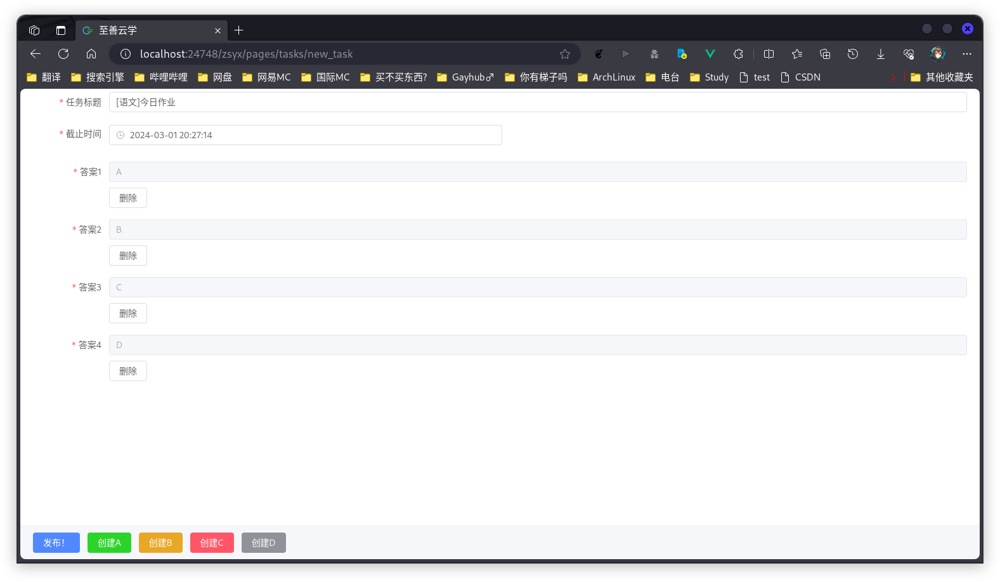
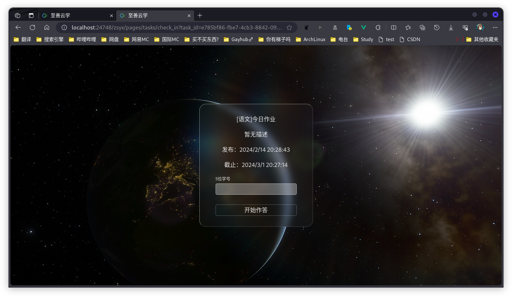
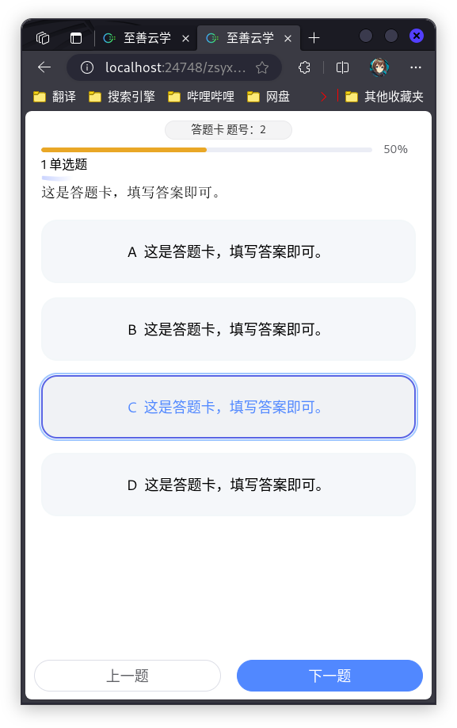
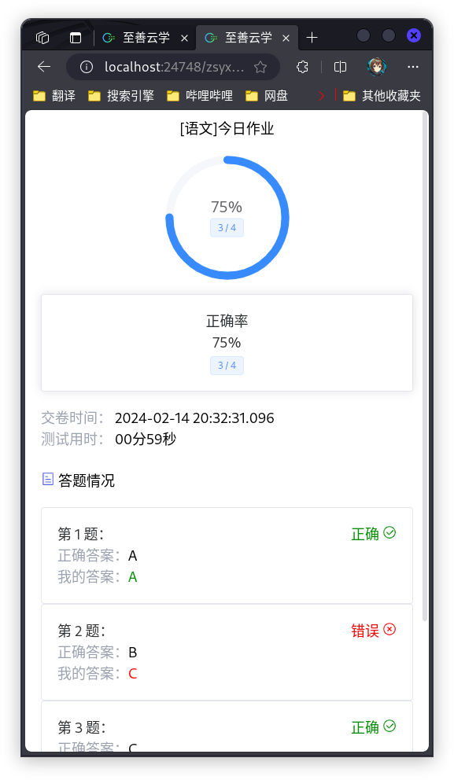
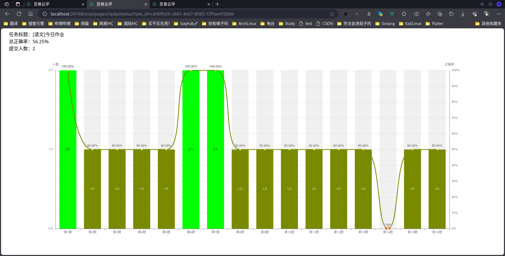

<h2 align="center" style="font-weight: 600">vue-zhishanyunxue-client</h2>
<p align="center">
    基于Vue3的<a>至善云学</a>前端
    <br />
    Version: 1.0.0
</p>

## ✨ 特性

- 📔 支持基本功能 新建任务 查看任务情况 任务作答 任务评分

## 📦️ 开发&打包

- 🛠 [配套API文档](https://apifox.com/apidoc/shared-df1fc889-ef10-4dfa-a199-1e75da2160a3)

```shell
# 依赖
npm i

# 运行
npm run dev

# 打包
npm run build
```

## 💻 运行

可以集成到至善云学后端使用 或者单独部署

1. 在front/config.js文件中修改api_url来指向正确的后端API服务器地址
2. 您的主机地址 + /zsyx/pages/tasks/new_task

## ☑️ Todo

1. 任务列表

欢迎提 Issue 和 Pull request。

## 📜 开源许可

本项目仅供个人学习研究使用，禁止用于商业及非法用途。

基于 [LGPL-3.0](https://www.gnu.org/licenses/lgpl-3.0.en.html#license-tex) 许可进行开源。

## 🖼️ 截图






